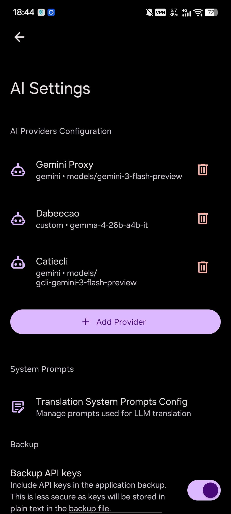
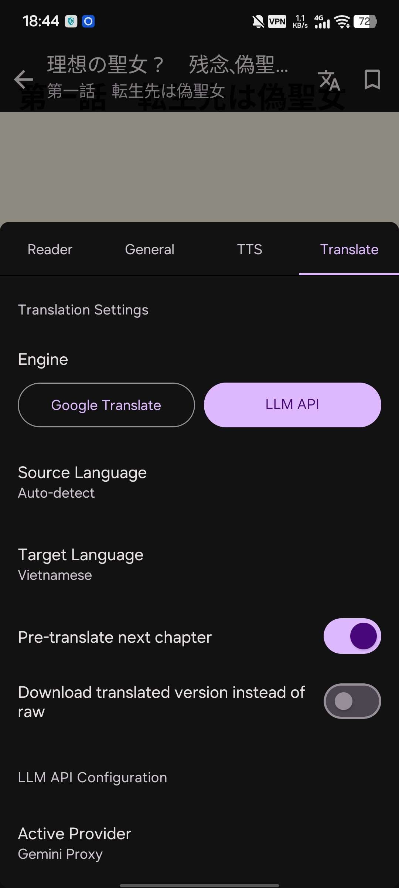
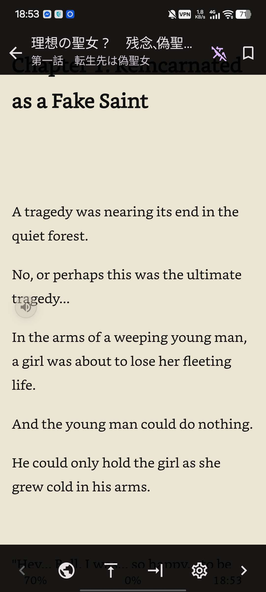
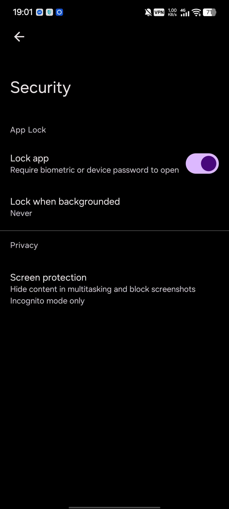
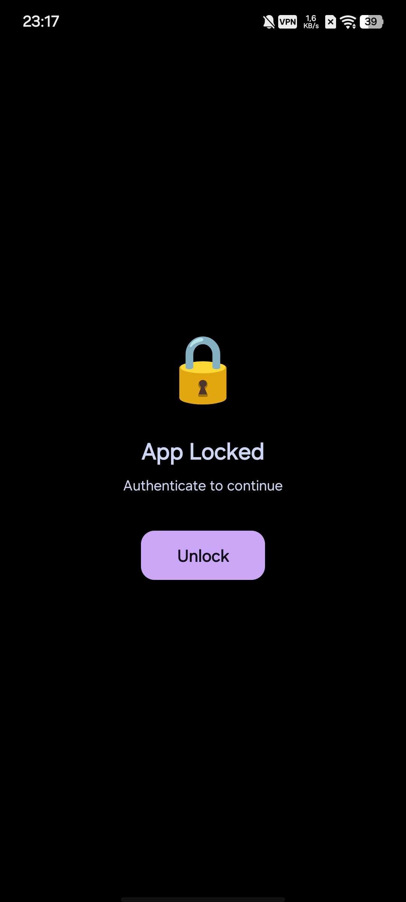
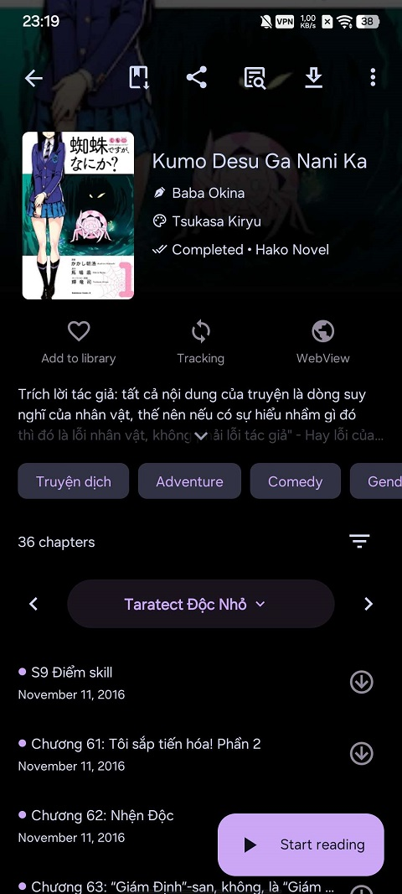
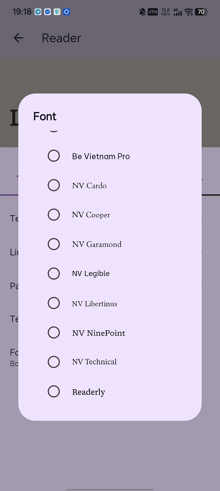
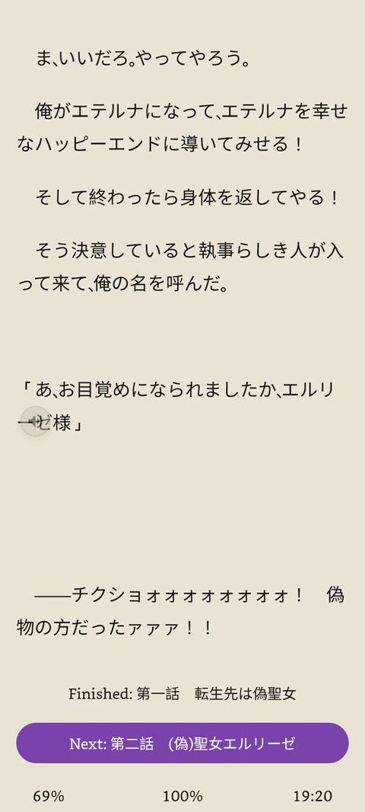

## LNReader eXtended

This is a modified version for my personal use. It is perfectly compatible with the original LNReader's plugins and backup files, allowing you to easily migrate to this application.

> [!WARNING]  
> This version is not recommended for production use.

> [!CAUTION]  
> Despite having a similar icon and app name, this application is not affiliated with the original app (I just haven't come up with a better icon and name yet).

> [!NOTE]  
> This fork uses AI slop.

---

### What’s different from LNReader?

<b>Built-in chapter translation</b> (Click to expand/collapse)

- Translate novels directly in the reader using Google Translate
- Translate with an LLM (OpenAI/OpenAI-compatible APIs or Gemini/Gemini Proxy)
- Manage LLM providers
- Manage translation system prompts
- Automatically pre-translate the next chapter
- Enable or disable chapter splitting by word count to avoid exceeding the model's context window
- Automatically retry failed translations
- Download translated chapters for offline reading
- Optionally include LLM API keys in backups
- And many more features coming soon...

|                                                                    |                                                                        |                                                             |
| :----------------------------------------------------------------: | :--------------------------------------------------------------------: | :---------------------------------------------------------: |
|  |  |  |

<b>Privacy and Security</b> (Click to expand/collapse)

- The reader WebView now automatically upgrades insecure HTTP connections to HTTPS.
- Implement DNS over HTTPS (DoH) for enhanced security and bypass capabilities, using the same User-Agent as Mihon.
- Set separate privacy rules for mixed-content and NSFW sources.
- Security features are inspired by Mihon. Special thanks to the developers for creating such an excellent app.
- Fixed a path traversal vulnerability.

|                                                                         |                                                               |
| :---------------------------------------------------------------------: | :-----------------------------------------------------------: |
|  |  |

<b>Reader Features</b> (Click to expand/collapse)

- Partial support for organizing Japanese Light Novels into "series" and "volumes" based on the legacy Page structure.
- Fixed most issues with the paged reading mode.
- Swiping to change chapters now uses vertical gestures (when paged reading is disabled), providing a more ergonomic reading experience.
- Optimized for E-Ink displays (untested).
- Added more reading fonts.
- Render Markdown formatting in novel summaries.
- Search for text directly within the reading (chapter) screen.

|                                                                 |                                                           |                                                                |
| :-------------------------------------------------------------: | :-------------------------------------------------------: | :------------------------------------------------------------: |
|  |  |  |

<b>EPUB-Specific Features</b> (Click to expand/collapse)

- The EPUB importer has been extensively improved and now provides much better support for EPUB 2 and EPUB 3.
- The EPUB exporter has been significantly improved, fixing many critical issues, including:
  - Export failures when a chapter contains multiple images
  - Compatibility issues with some EPUB readers
  - Chapter ordering issues

> Exported EPUBs follow the EPUB 3 specification and pass most EPUBCheck v5 validations (depending on the novel's HTML content).

- A dedicated export log screen is available during EPUB export, making the waiting time more informative.
- Open `.epub` files directly to import them into the app.

<b>App and UI/UX Improvements</b> (Click to expand/collapse)

- Support for Android Dynamic Colors (Material You).
- Discord Rich Presence (RPC), so you can share your reading status with your friends.
- Added a Debug menu and a Storage/Cache viewer.
- Optimized the Backup & Restore menu to prevent UI freezes.
- Search history for novels across sources and libraries.
- Added support for Samsung S Pen Air Actions (available on the N10-N20U/S21U-S24U/Tab S6-Tab S10U), allowing users to control the app without touching the screen.
- Displays the current URL in the app's WebView.
- Added support for the `<video>` element, along with experimental video playback support.
- Added many new libraries and APIs for plugin developers.
- Enable or disable plugin repositories.
- Built-in Cloudflare/Turnstile solver (with APIs available for plugins).
- Warns when an installed plugin no longer exists (has been removed) from its repository.
- Shows content-type icons and 18+ badges for sources that provide metadata, and preserves compatible plugin settings during updates.
- Added a statistics screen showing total reading time for each novel and chapter.
- Added several user warning dialogs.
- Improved backup and restore performance, along with a log screen to provide progress feedback.
- Optimized several database queries.
- Improved various UI and UX aspects.

<b>Upcoming Features</b> (Click to expand/collapse)

> Here are some of the features I plan to add in the future:

- Advanced novel translation with improved translation consistency.
- Stable background Text-to-Speech (TTS) playback.
- More detailed reading statistics, including per-session tracking to enable daily statistics.
- Search within the current chapter or across the entire novel.
- Features inspired by other novel reader apps that I find useful.
- Selected feature requests from the upstream repository.

---

<b>Original README</b> (Click to expand/collapse)

  

<h1 align="center">LNReader</h1>

  LNReader is a free and open source light novel reader for Android, inspired by Tachiyomi.

  
  

  
  
  

<h2 align="center">Download</h2>

  
  

  Get the app from our <a href="https://github.com/lnreader/lnreader/releases">releases page</a>.

  <em>Android 7.0 or higher.</em>

<h2 align="center">Screenshots</h2>

  

## Plugins

LNReader does not have any affiliation with the content providers available.

Plugin requests should be created at [lnreader-plugins](https://github.com/lnreader/lnreader-plugins).

## Translation

Help translate LNReader into your language on [Crowdin](https://crowdin.com/project/lnreader).

## Building & Contributing

See [CONTRIBUTING.md](./CONTRIBUTING.md)

## License

[MIT](https://github.com/lnreader/lnreader/blob/main/LICENSE)

